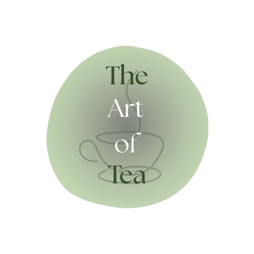

# The Art of Tea

 

Art of Tea is a prototype for a semantic digital library of resources that traces not only the complex history of the tea leaf and its ties to shifting global powers, global trade, wars, and colonialism, but also the different ways it has become interwoven into cultures across the world.

The project is built on the architecture of **IIIF**, a framework for sharing and creating interoperable digital resources accessible across the internet. On top of this infrastructure is the **ArTea graph**, which conceptually maps all the items in the library to various aspects of tea, linked to the subject authority files of the **Library of Congress**.

The final goal is to create a fully semantically interconnected digital library, linking not only the subjects of the items but also the entities within them, supported by IIIF annotation and search services. In this way, the library aims to support the study of tea history and culture while acting as a digital semantic reflection of the long-lasting influence of the tea leaf.

---

## Repository Structure

- `Resource/Books` → Selected books included in the project  
- `Resource/Images` → Selected visual materials  
- `Resource/Journals` → Materials added for future development  
- `TheArtOfTea.ttl` → RDF ontology describing all items  

---

## Website Structure

The presentation is made through a website built with **Bootstrap**. The website includes three main sections:

### 1. Homepage (`index.html`)
Contains general information about the project and its objectives.

### 2. Documentation (`documentation.html`)
Includes:
- Explanation of the project motivations  
- Workflow description  
- References  
- Tools used  
- Future directions  
- Team section  

### 3. Viewer (`viewer.html`)
This page allows books and images to be viewed individually through IIIF.  
Each item is displayed with its related metadata and description.

The items are dynamically loaded through a script inside the page, based on the selection made by the user.

---

## Ontology

All items are semantically modeled in the `TheArtOfTea.ttl` file using RDF.  
The ontology connects works, subjects, and entities in a structured semantic graph.

---

## About the Project

This project was developed as part of the **Semantic Digital Library** course at the University of Bologna, within the Master's Degree Program in **Digital Humanities and Digital Knowledge**.

All materials included in the library are openly accessible.
